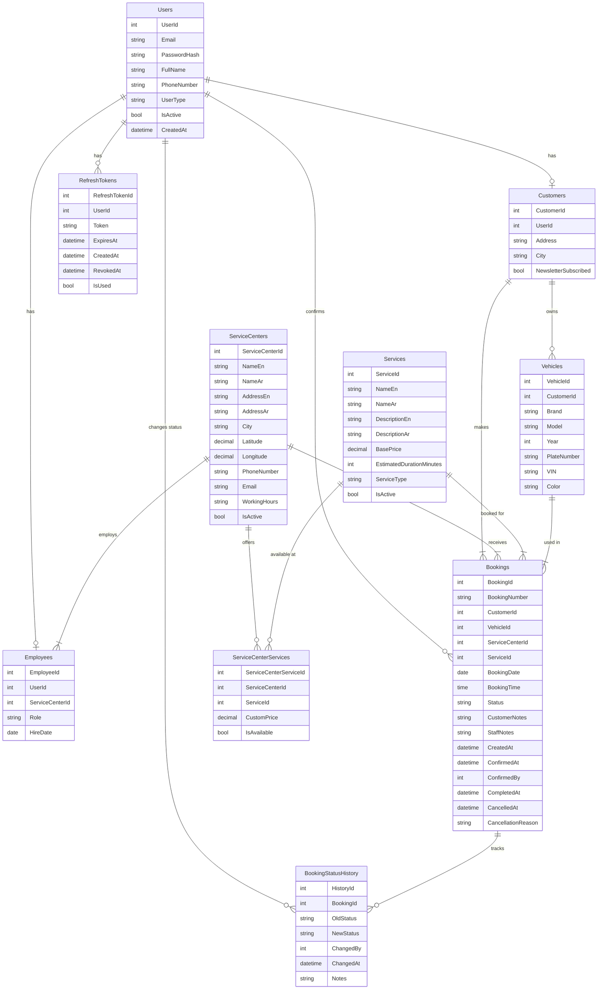

```mermaid
erDiagram
    Users ||--o| Customers : "has"
    Users ||--o| Employees : "has"
    Users ||--o{ RefreshTokens : "has"
    Users ||--o{ BookingStatusHistory : "changes status"
    Users ||--o{ Bookings : "confirms"

    Customers ||--o{ Vehicles : "owns"
    Customers ||--|{ Bookings : "makes"

    ServiceCenters ||--|{ Employees : "employs"
    ServiceCenters ||--|{ Bookings : "receives"
    ServiceCenters ||--o{ ServiceCenterServices : "offers"

    Services ||--o{ ServiceCenterServices : "available at"
    Services ||--|{ Bookings : "booked for"

    Vehicles ||--|{ Bookings : "used in"

    Bookings ||--o{ BookingStatusHistory : "tracks"

    Users {
        int UserId
        string Email
        string PasswordHash
        string FullName
        string PhoneNumber
        string UserType
        bool IsActive
        datetime CreatedAt
    }

    Customers {
        int CustomerId
        int UserId
        string Address
        string City
        bool NewsletterSubscribed
    }

    Employees {
        int EmployeeId
        int UserId
        int ServiceCenterId
        string Role
        date HireDate
    }

    ServiceCenters {
        int ServiceCenterId
        string NameEn
        string NameAr
        string AddressEn
        string AddressAr
        string City
        decimal Latitude
        decimal Longitude
        string PhoneNumber
        string Email
        string WorkingHours
        bool IsActive
    }

    Services {
        int ServiceId
        string NameEn
        string NameAr
        string DescriptionEn
        string DescriptionAr
        decimal BasePrice
        int EstimatedDurationMinutes
        string ServiceType
        bool IsActive
    }

    ServiceCenterServices {
        int ServiceCenterServiceId
        int ServiceCenterId
        int ServiceId
        decimal CustomPrice
        bool IsAvailable
    }

    Vehicles {
        int VehicleId
        int CustomerId
        string Brand
        string Model
        int Year
        string PlateNumber
        string VIN
        string Color
    }

    Bookings {
        int BookingId
        string BookingNumber
        int CustomerId
        int VehicleId
        int ServiceCenterId
        int ServiceId
        date BookingDate
        time BookingTime
        string Status
        string CustomerNotes
        string StaffNotes
        datetime CreatedAt
        datetime ConfirmedAt
        int ConfirmedBy
        datetime CompletedAt
        datetime CancelledAt
        string CancellationReason
    }

    BookingStatusHistory {
        int HistoryId
        int BookingId
        string OldStatus
        string NewStatus
        int ChangedBy
        datetime ChangedAt
        string Notes
    }

    RefreshTokens {
        int RefreshTokenId
        int UserId
        string Token
        datetime ExpiresAt
        datetime CreatedAt
        datetime RevokedAt
        bool IsUsed
    }
```
